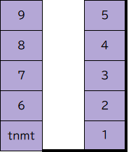

## ペパボ席替えコード 2025

10年ぶりの席替えコード会場です。Pull Request する際はリポジトリには存在しない言語でお願いします。

ペパボ以外の方もぜひプルリクエストを。~ペパボ新卒エンジニア達に社会の厳しさを教えてやってください。（新卒氏が書けそうな言語は優しさで残しておいてください）~

今年の席は9席です！

tnmtは固定席で、以下の9名がどこに座るのかわかればOKです。

- zipper
- takutaka
- drumato
- ressy
- shibatch
- masaki
- chiroru
- ryu-ch
- kmsn
