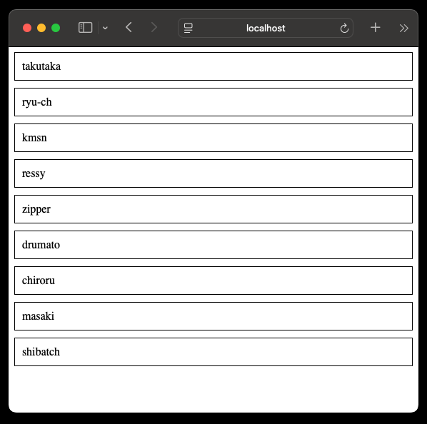

# sekigae2025 CSS `random()` ver

CSS の random() を用いてシャッフルします。
https://drafts.csswg.org/css-values-5/#random

Safari Technology Previewで動作します。席の番号を行の順番で読み替えてください。
https://webkit.org/blog/17285/rolling-the-dice-with-css-random/

(この実装はアクセシブルではないので注意してください。あくまでramdom()の実験的な利用ということです。)
https://developer.mozilla.org/ja/docs/Web/CSS/order#%E3%82%A2%E3%82%AF%E3%82%BB%E3%82%B7%E3%83%93%E3%83%AA%E3%83%86%E3%82%A3

`npm run dev` で開発サーバが起動します。
